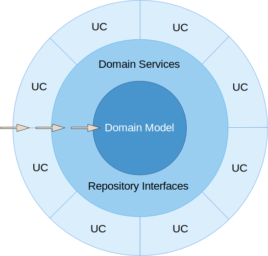
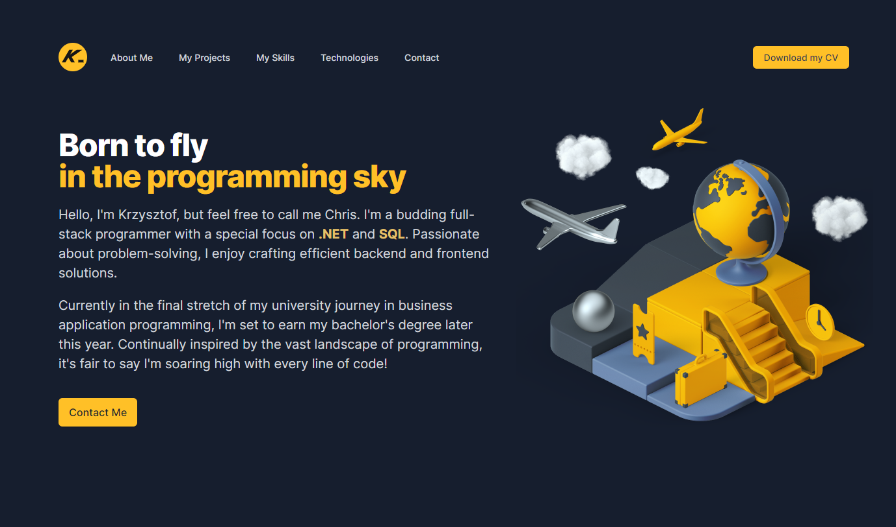

<div align="center">
    <h1>
        
        Gym Manager
    </h1>
    <h3>
        <a href="#preview">
            Preview
        </a>
        <span> | </span>
        <a href="#quickstart">
            Quickstart
        </a>
        <span> | </span>
        <a href="https://github.com/chrisonoo/GymManager">
            GitHub
        </a>
    </h3>
    <p>Total gym management application</p>
    <p><b>Status:</b> Project under development</p>
    <br>
    <p>Technologies and tools:</p>
    <p>
        
        
        
        
        
        
        
        
        
        
        
        <br/>
        
        
        
        
        
        
        
        
        
        
    </p>
</div>

<h2 id="table-of-contents">Table of Contents</h2>

- [Description](#description)
- [Preview](#preview)
- [Quickstart](#quickstart)
- [Functionality](#functionality)
- [Database Schema](#database-schema)
- [Feature List](#feature-list)
- [Technologies, Strategies and Programming Techniques](#technologies-strategies-and-programming-techniques)
- [Dependencies, Tools](#dependencies-tools)
- [Workflow](#workflow)
- [Summary](#summary)
- [Known Issues](#known-issues)
- [Contribution Guidelines](#contribution-guidelines)
- [License](#license)
- [About Me](#about-me)

## Description

`Gym Manager` is a comprehensive application built with `ASP.NET Core 6 MVC` and `ASP.NET Core 6 Web API` technologies, powered by an `MSSQL` database. It offers an intuitive and fully-featured solution for managing all aspects of gym operations. From member registration and tracking, scheduling and managing fitness classes, to payment processing and detailed reporting - Gym Manager is an all-in-one tool designed to streamline gym operations, enhancing both management efficiency and member experience.

[[top](#table-of-contents)]

## Preview

Remember! The application `is not finished` and `may have many errors`. I'm still developing it, so most often a new version lands on GitHub and hosting every day. If logins and passwords are provided for the application, you can frolic changing whatever you want.

### User accounts available in the application

```
    ROLE:       Admin
    USER:       admim@test.com
    PASSWORD:   TEst!@12
```

### Local way to run the project on computer

There are two ways to run the application. You can do it locally on your computer, in a maximum of 10 minutes. You don't even have to install MSSQL, because Visual Studio has built-in support for simple databases. This method is discussed in the Quickstart section.

> Check how to run the application locally: [Gym Manager Local](#quickstart)  
> You can use already configured accounts in the application: [User Accounts](#user-accounts-available-in-the-application)

### Online version of the application

The application `may contain errors`, do not submit `any sensitive data` there. I bear `no responsibility for any data loss`, and you use the application `at your own risk`, waiving any claims.

> Preview application online: [Gym Manager Online](https://gym.onoo.app/)  
> You can use already configured accounts in the application: [User Accounts](#user-accounts-available-in-the-application)

[[top](#table-of-contents)]

## Quickstart

... under development

[[top](#table-of-contents)]

## Functionality

The application is a comprehensive manager for a gym. It assists in managing a gym from an administrative perspective and allows customers to browse the gym's offerings, check trainers' schedules, and view trainers' profiles. Customers can also purchase selected services and passes online or contact the reception by phone.

The application consists of the following elements:

- A module for all users, available publicly
- A client module, available after logging in
- A reception module, available after logging in
- A trainer's module, available after logging in
- An administrative module, available after logging in

[[top](#table-of-contents)]

## Database Schema

<details>
<summary>Database Schema Details<h2/></summary>
</details>

[[top](#table-of-contents)]

## Feature List

### Unregistered users have the ability to:

- Browse the gym's offer
- Familiarize themselves with the price list
- View individual trainers' pages
- Choose the application's language
- Set up a client account
- Log into the client panel
- Send a message to the gym

### Logged in clients can:

- Browse purchase history
- View active services or passes
- Purchase services or passes
- Print purchase invoice to PDF

### The reception staff can:

- Search for a client and check their active services
- Sell a service or pass
- Add/Edit a client
- Check trainers' work schedules

### Trainers can:

- Browse their work schedule
- Add/Edit their work schedule
- Add/Remove/Edit a page with information about themselves

### Admin can:

- Edit certain elements of the page
- Add/Remove/Edit services
- Add/Remove/Edit trainers
- Add/Remove/Edit employees
- Add/Remove/Edit clients
- Manage schedules
- Add roles in the system
- Manage files uploaded to the server (graphics, PDFs)

### Functional elements of the application:

- Multilingual content support
- Pagination of displayed data
- Dynamic data searching
- Filter of active records (soft delete)
- Profile pictures support

[[top](#table-of-contents)]

## Technologies, Strategies and Programming Techniques

- ASP.NET Core 6 MVC
- ASP.NET Core 6 Web API
- C# 10
- Entity Framework (utilizing both **Annotations** and **Fluent API**)
- Code First database and Seeding
- Automatic Resource Management with the **using** statement (during seeding)
- Soft Delete
- SOLID
- CRUD
- CQRS
- Onion Architecture
- DTO, DAO, ViewModel
- Dependency Injection
- Extension Methods
- Middleware
- Data validation
- Unit and integration tests

[[top](#table-of-contents)]

## Dependencies, Tools

- Microsoft.EntityFrameworkCore.SqlServer 7.0.9
- Microsoft.EntityFrameworkCore.Tools 7.0.9
- Microsoft.VisualStudio.Web.CodeGeneration.Design 6.0.15
- Swagger
- AJAX
- MediatR
- FluentValidation
- AutoMapper
- SignalR
- Toastr

[[top](#table-of-contents)]

## Workflow

```
⬜    - Task pending
⬜ ⏳ - Task in progress
✅    - Task completed
```

- [ ] Plan the application project
    - [ ] ⏳ Define the goals of the application
    - [ ] ⏳ Define the features of the application
    - [x] Choose the technology and architecture of the application
    - [ ] ⏳ Design the database
    - [ ] Design the UI/UX
        - [ ] Design light theme
        - [ ] Design dark theme
    - [ ] ⏳ Plan the work and create a Workflow
- [ ] Prepare application infrastructure
    - [x] Create a project on GitHub
    - [x] Prepare an informational page
    - [x] Configure a subdomain for the application on [onoo.app](https://onoo.app/)
    - [x] Add application to the Showroom [gym.onoo.app](https://gym.onoo.app/)
    - [x] Create project structure with references - Onion Architecture
        - [x] Add solution `GymManager`
        - [x] Add project `GymManager.UI` - ASP.NET Core 6 MVC main application project, reference to GymManager.Infrastructure
        - [x] Add project `GymManager.Domain` - Class Library (.NET 6), no references
        - [x] Add project `GymManager.Application` - Class Library (.NET 6), reference to GymManager.Domain
        - [x] Add project `GymManager.Infrastructure` - Class Library (.NET 6), reference to GymManager.Application
- [ ] `GymManager.Application`
    - [x] Add DependencyInjection class
- [ ] `GymManager.Domain`
- [ ] `GymManager.Infrastructure`
    - [x] Add DependencyInjection class
- [ ] `GymManager.UI`
- [ ] Database, **code-first** approach
    - [ ] Plan the Entity classes, incorporate the **soft-delete** strategy
    - [ ] Adď the Entity classes
    - [ ] Add Annotations and Fluent API configuration to the Entity classes
    - [ ] Add Database configuration
    - [ ] Add migration
    - [ ] Update database
- [ ] Add demonstration data to the application (seeding).
- [ ] Completion of project documentation
    - [x] Header
    - [x] Description
    - [x] Preview
    - [ ] Quickstart
    - [ ] ⏳ Functionality
    - [ ] ⏳ Database Schema
    - [ ] ⏳ Feature List
    - [x] Technologies, Strategies and Programming Techniques
    - [x] Dependencies, Tools
    - [ ] Workflow
    - [ ] Summary
    - [ ] Known Issues
    - [x] Contribution Guidelines
    - [x] License

[[top](#table-of-contents)]

## Summary

The summary will be provided once the project is completed.

[[top](#table-of-contents)]

## Known Issues

So far, no insurmountable problems have been identified, so the work is ongoing.

[[top](#table-of-contents)]

## Contribution Guidelines

This is an educational project and I'm working on it independently, but any suggestions or comments are highly appreciated. Please open issues to share your feedback.

[[top](#table-of-contents)]

## License

The project has been completed and will not be further developed, but any suggestions are welcome. Please open issues to share your feedback.

[[top](#table-of-contents)]

## About Me

Hello, I'm Krzysztof, but feel free to call me Chris. I'm a budding **`full-stack`** programmer with a special focus on **`.NET`** and **`SQL`**. Passionate about problem-solving, I enjoy crafting efficient **`backend`** and **`frontend`** solutions.

As an emerging software developer, I'm keen to apply my knowledge and skills in a professional setting. I'm excited to bring my life and professional experience, providing a unique perspective to software development tasks. Eager to commence my journey in the industry, I am **`actively seeking employment opportunities`** where I can continue to grow and create.

Check out my [Portfolio](https://onoo.no/portfolio) or connect with me on [LinkedIn](https://www.linkedin.com/in/k-p-z/).

[[top](#table-of-contents)]

[<div align="center"><br/></div>](https://onoo.no/portfolio)


